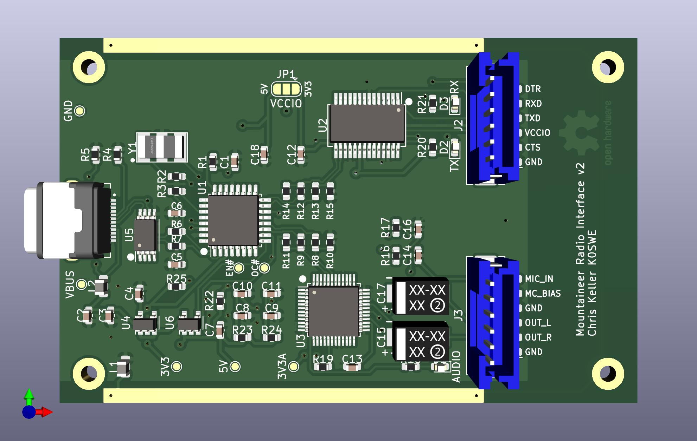

# TX-500 Data Interface

This KiCAD project is a schematic for an integrated CAT and audio amateur radio interface. It's
designed with the [Lab599 Discovery TX-500](https://lab599.com/) radio in mind, but the only thing
that makes it radio-specific is the GX12 connectors for CAT and DATA. The rest of the board is a
generic USB-to-serial and audio interface and is suitable for many radios.

This is somewhat comparable to the Yaesu SCU-17 interface in that it provides both audio
and [CAT control](https://en.wikipedia.org/wiki/Computer_Aided_Transceiver). It is less like the
SignaLink USB interface which only provides audio plus a VOX-based PTT signal but not CAT control.

My design goals are to make this much like the TX-500 itself: small, lightweight and rugged enough
to be outdoors. As such, volume knobs and headphone monitor jacks are not incorporated.
